# Github and Git Tutorial #
介绍使用Github账户+mysysgit+TortoiseGit进行代码管理。

## 安装 ##

### 安装mysysgit ###

下载地址：[mysysgit](http://code.google.com/p/msysgit/downloads/list?q=full+installer+official+git)。下面的截图来自[Git-1.8.1.2-preview20130201.exe](http://code.google.com/p/msysgit/downloads/detail?name=Git-1.8.1.2-preview20130201.exe&can=2&q=full+installer+official+git) 。

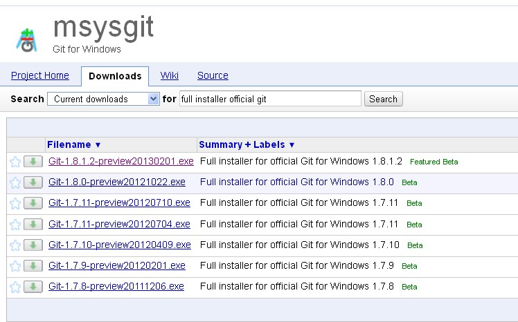

安装过程：

0.启动

1.默认

2.默认

3.默认

4.默认

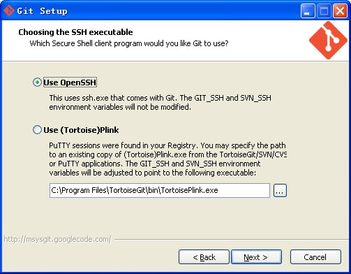

5.这步骤很重要，选中 **Checkout as-is** 。这样使用 **git clone** 时，git不会擅自改动所获文件的换行符。

6.默认

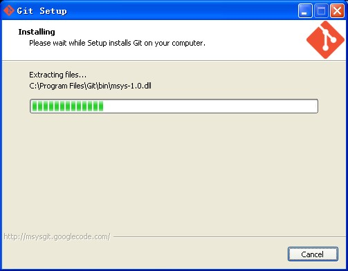

7.安装完成。

###安装Tortoise###
下载地址：[TortoiseGit](http://code.google.com/p/tortoisegit/wiki/Download?tm=2) 。下面的截图来自[TortoiseGit 1.8.3.0 - 32-bit](http://tortoisegit.googlecode.com/files/TortoiseGit-1.8.3.0-32bit.msi) 。

0.启动

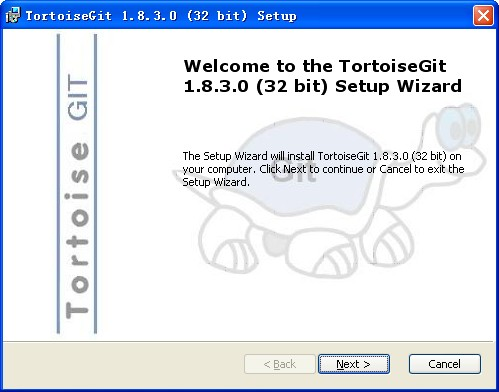

1.默认-Next

2.默认-Next

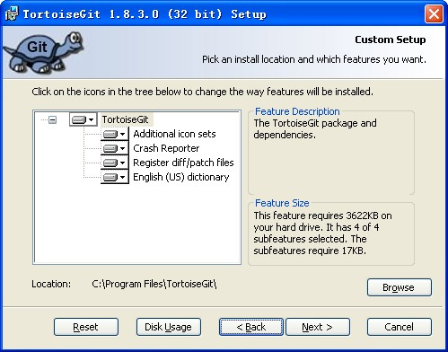

3.默认-Next

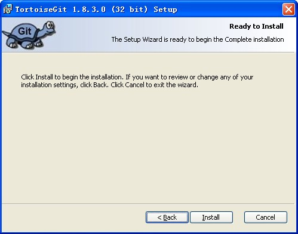

4.默认-Install

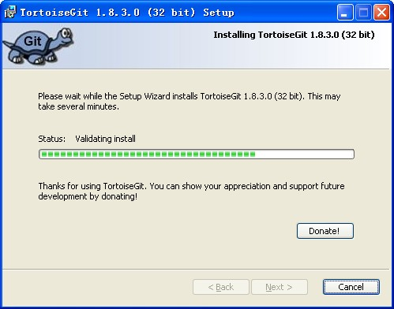

5.完成

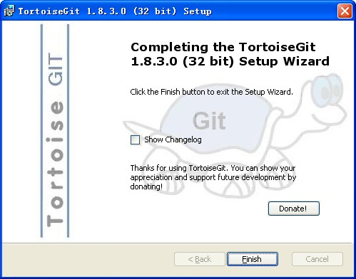

## 设置 ##

### TortoiseGit 设置 ###

开始->所有程序->TortoiseGit->Settinigs，填入 **Name** 和 **Email** 信息。

这里需要说明，每次通过GIT提交文件时都需要 **Name** & **Email** 信息。这个信息会连同 **Commit Comment** 显示在Github的Commit记录里。

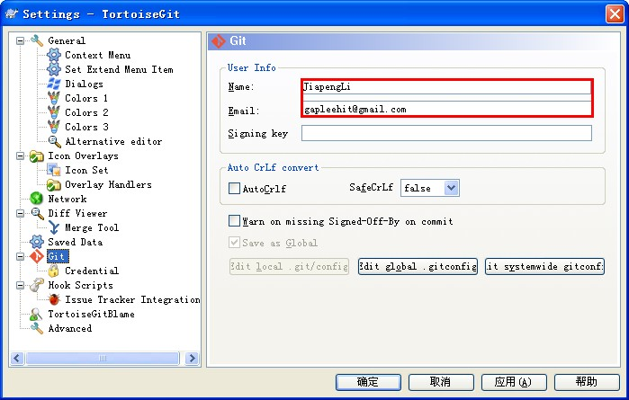

提交之后可以在仓库 **Commit** 记录中体现出来

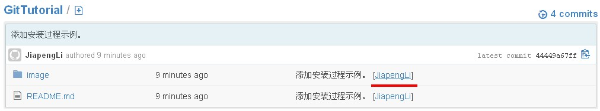

***为简单起见其他所有的设置项项暂时我们都不做修改，可以在使用中逐渐摸索。***

## 用法 ##

### 配合Github使用 ###

1.登陆github（如没有账号，则需新建一个账号）。点击 **Sign in** 按钮进入登陆页面,填写用户名（或邮箱）与密码后登陆。（用户名与邮箱名不区分大小写，而密码区分大小写）

2.进入 **Account Settings** ，添加 **SSH Key** 。 **SSH Key** 是用户使用SSH工具(本教程里用的是TortoiseGIT里集成的工具)登陆或上传文件至Github时用的密码。

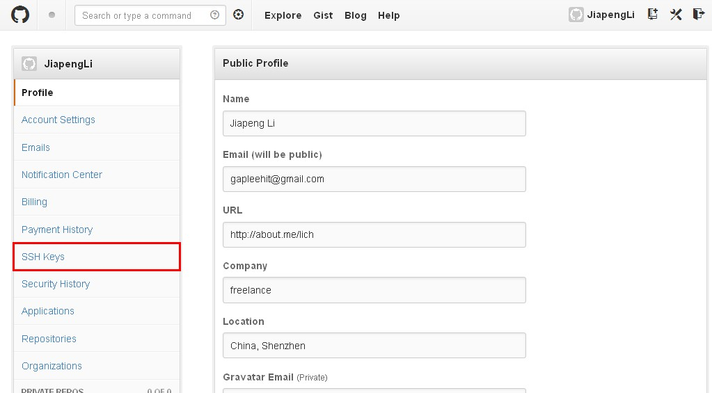

3.先从Github上退回到本地。我们需要添加 **SSH Key**， 但是我们现在还没有，所以制作一个先。
开始->所有程序->TortoiseGit->Puttygen 

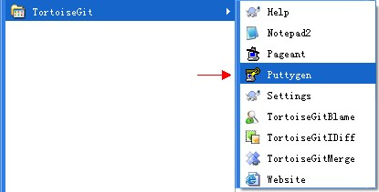

点击 **Generate** 按钮开始生成，在指定的区域内移动鼠标加速 **SSH KEY**的产生。

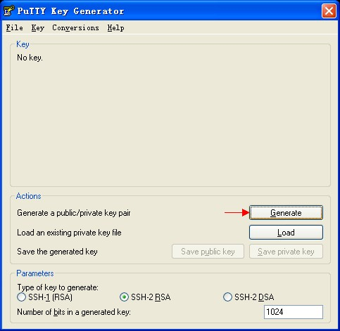

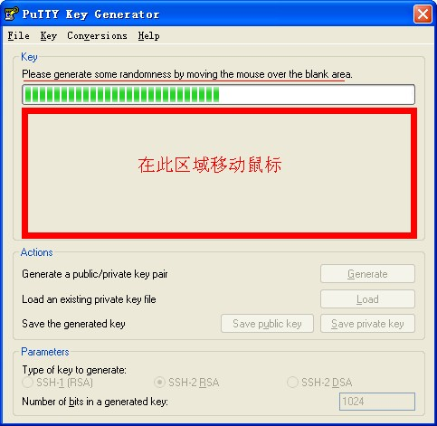

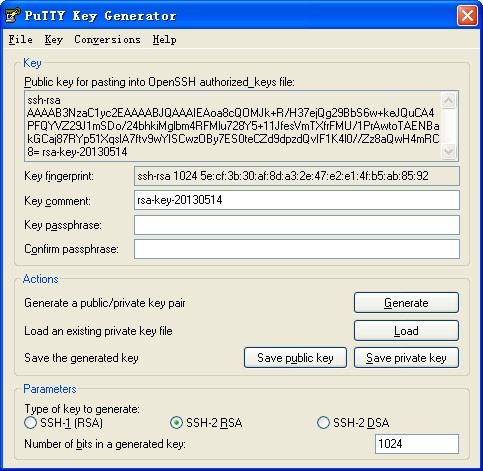

点击 **Save private key** 保存密钥。由于我们没有设置密码，这时会弹出一个窗口问我们是否真的不需要设置 **SSH key** 保护密码。设置密码之后更安全，但在使用的时候每次推送文件都会提示你输入此密码，比较啰嗦，这里可根据个人喜好选择。

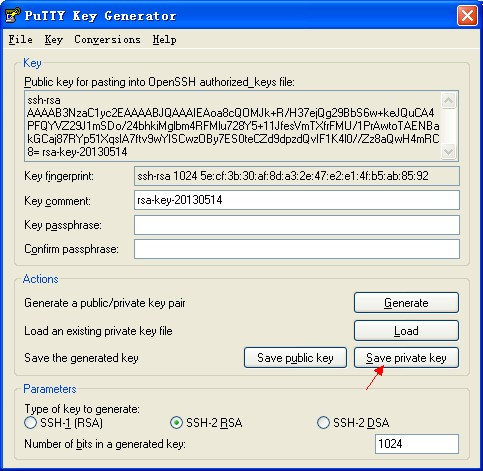

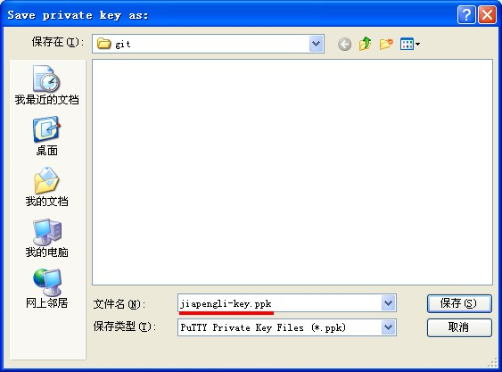

*不需要设置密码的同学可以略过下图*

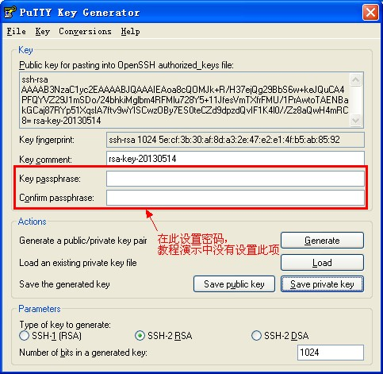

 **暂时不要关闭Puttygen下面还要用到**，如果很不幸你没有看到这句提示。那么也不要紧，重新做一遍吧。

不想重新做一遍的同学可以打开刚才保存的密钥， **File->Open private key** 。如果有同学已经重做，那么恭喜你，你中招了。

4.整理思绪回到Github网站上，相信刚才的页面你还没有关闭，如果关闭了，或者找不到了，那么重新登陆你的Github，右上角点击 **Account Settings** ，然后找到 **SSH Keys**, 点击 **Add SSH Keys** 开始添加。

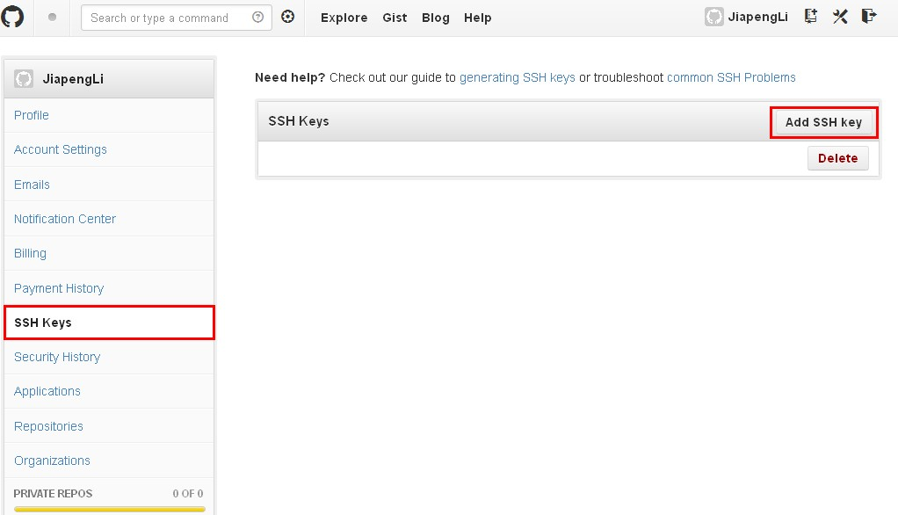

切换到 **Puttygen** 软件，拷贝Public Key 至Github上的 **Add an SSH Key -> Key**窗口。点击 **Add key** ，再之后弹出的密码确认框中输入Github账户密码 点击 **Confirm Password** 完成添加。

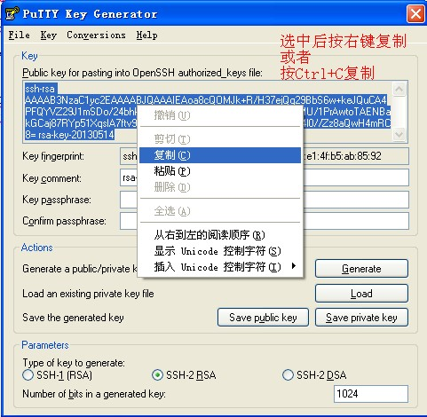

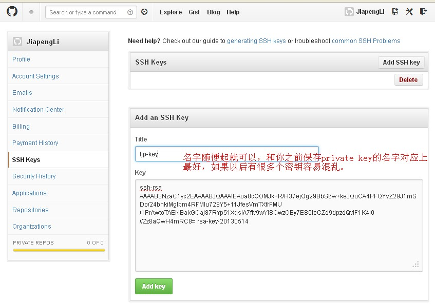

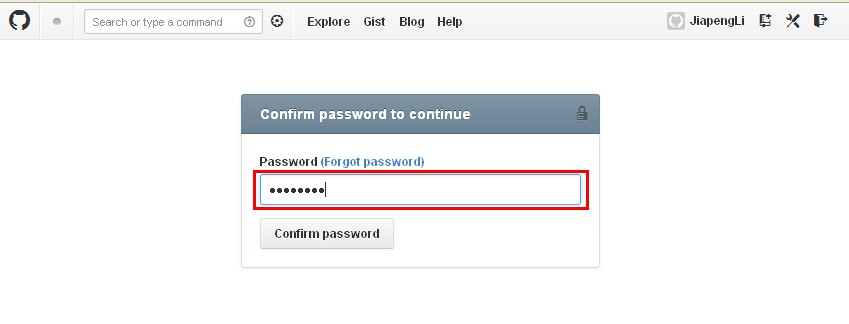

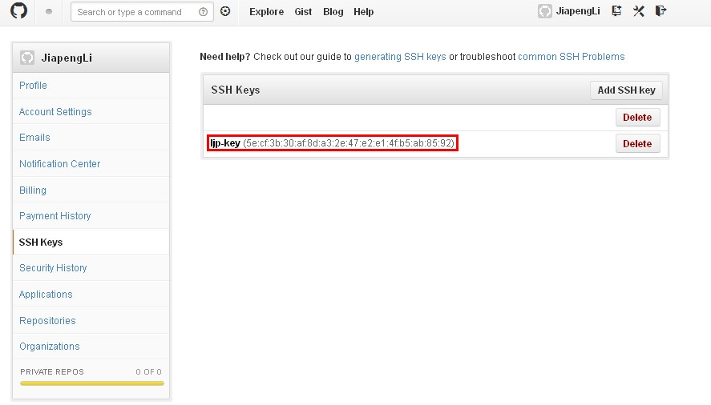

5.现在基本工作已经完成了，下面我们可以开始在Github上建立 **Repository** 并上传文件至Github，开始我们的Github之旅了。

点击右上角的 **Create new repo** 建立新仓库，填入 **Name** (名称)与 **Description** (描述)后，点击 **Create repository** 创建仓库。

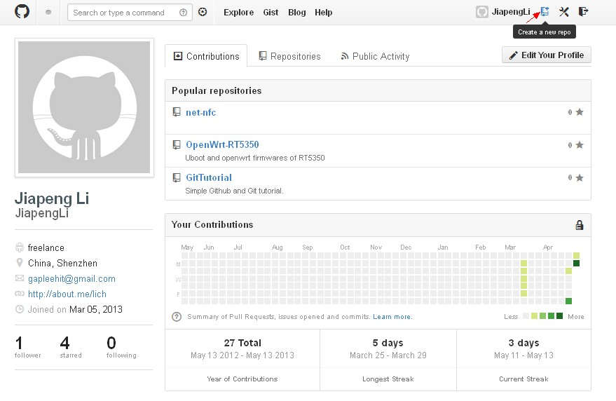

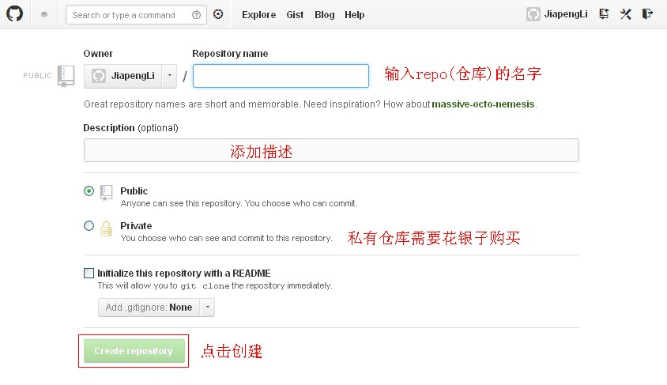

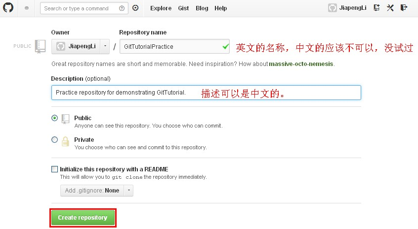

创建完仓库后，你的github页面大致如下图所示，红框中有几个可以点击的按钮， **Setup in Windows** , **HTTP** 和 **SSH** 。 

- **Setup in Windows** 不知道怎么使用。

- **HTTP** 非加密连接，只读属性，当获取其他用户的github文件时需要用此种格式的链接。

- **SSH** 加密链接，向自己的仓库中添加上传文件时需要用此种格式的链接，这里我需要使用的链接，即是 *git@github.com:JiapengLi/GitTutorialPractice.git* 。

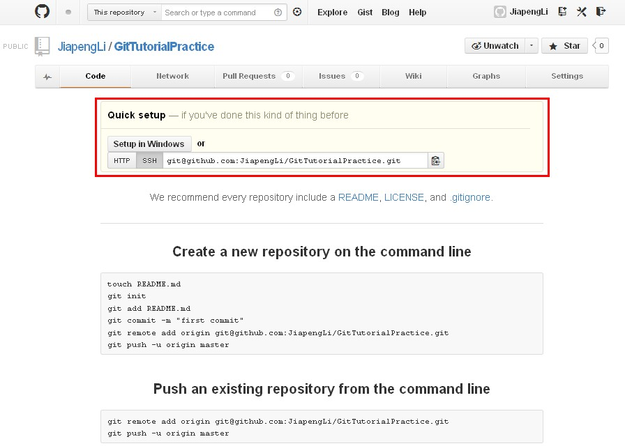

6.现在我们已经成功地在Github上面建立了一个仓库，接下来我们需要使用TortoiseGit工具 **Clone** 刚才建立的仓库，然后添加文件并上传。

- 在Windows资源管理器中单击 **右键**；
- 选择 **Git Clone**项；在 **URL** 项目中添加 **Repository** (仓库)的地址；
- 在 **Directory** 项目中填入目标文件夹(空文件夹或者不存在)；
- 在 **LoadPutty Key** 项目中载入刚刚建立的并保存的Private Key，点击 **OK** 按钮开始 **Clone**；
- **Clone** 结束后点击 **Close** 退出。

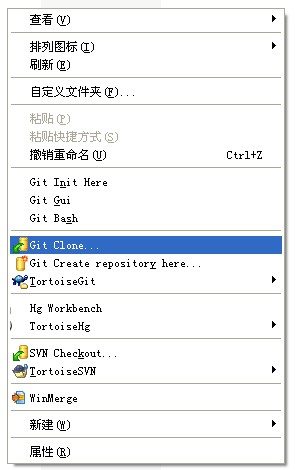

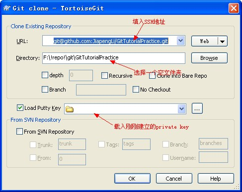

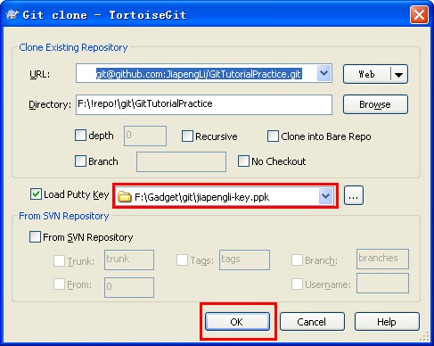

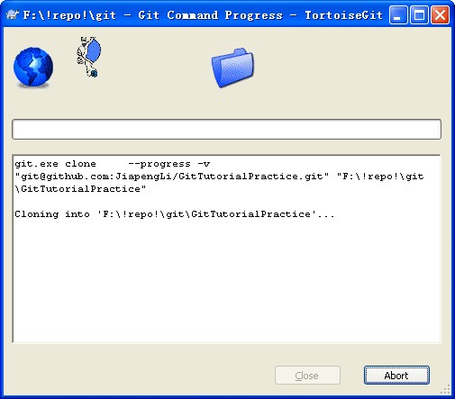

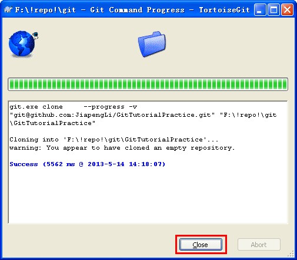

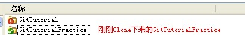